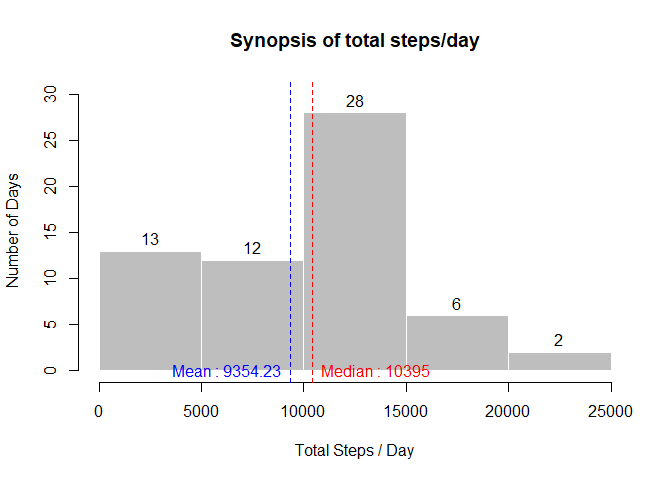
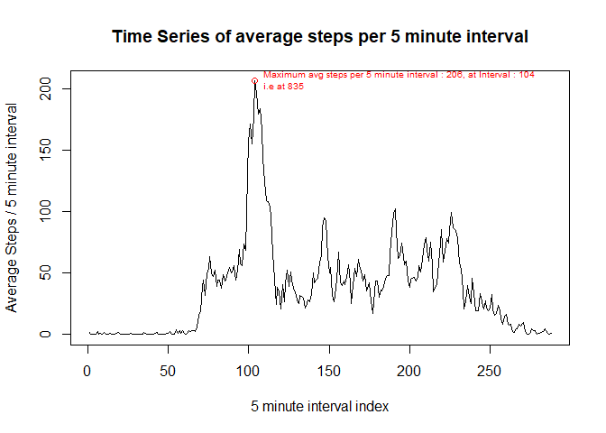
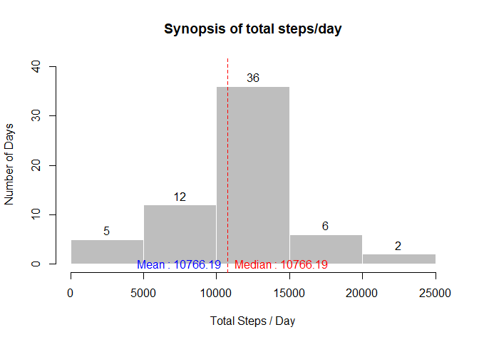
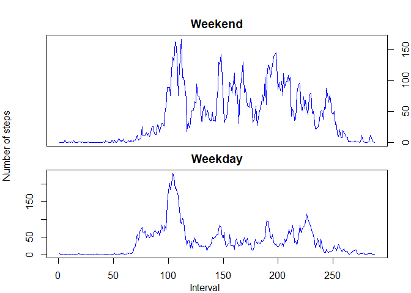

## Loading and preprocessing the data
Data is loaded using the basic read.csv function,as the data file is already downloaded in the project working directory and stored in a variable called 'activity'.

```r
activity <- read.csv(unz("activity.zip",filename = "activity.csv"))
str(activity)
```

```
## 'data.frame':	17568 obs. of  3 variables:
##  $ steps   : int  NA NA NA NA NA NA NA NA NA NA ...
##  $ date    : chr  "2012-10-01" "2012-10-01" "2012-10-01" "2012-10-01" ...
##  $ interval: int  0 5 10 15 20 25 30 35 40 45 ...
```
As can be observed since date is in character format, it is converted to date format with..

```r
activity$date <- as.Date(activity$date,tz = "Asia/Calcutta")
```
We also observe certain NAs in steps column, which for the time being is overlooked.

## What is mean total number of steps taken per day?
For this part of the assignment expectations are..

- Make a histogram of the total number of steps taken each day.
- Calculate and report the mean and median total number of steps taken per day.

The total steps per day is evaluated ('stepsperday') and subsequently plotted as..

```r
stepsperday <- with(activity,tapply(steps,date,sum,na.rm = TRUE))
hist(stepsperday,xlab = "Total Steps / Day",ylab = "Number of Days",main = "Synopsis of total steps/day",col = "gray",labels = TRUE,freq = TRUE,ylim = c(0,length(stepsperday)/2),border = FALSE)
abline(v = mean(stepsperday,na.rm = TRUE),col = "blue", lty=2)
text(mean(stepsperday,na.rm = TRUE),0,labels = paste("Mean : ",round(mean(stepsperday,na.rm = TRUE),2),sep = ""),col = "blue",pos = 2)
abline(v = median(stepsperday,na.rm = TRUE),col = "red", lty=2)
text(median(stepsperday,na.rm = TRUE),0,labels = paste("Median : ",round(median(stepsperday,na.rm = TRUE),2),sep = ""),col = "red",pos = 4)
```

<!-- -->

The mean 9354.23 and median 10395 are indicated by blue and red dashed lines respectively.

Since mean is less than median the data is skewed towards left as evident from the histogram.

## What is the average daily activity pattern?
For this part of the assignment expectations are..

- Make a time series plot (i.e. type = "l") of the 5-minute interval (x-axis) and the average number of steps taken, averaged across all days (y-axis).
- Which 5-minute interval, on average across all the days in the dataset, contains the maximum number of steps?

```r
head(activity)
```

```
##   steps       date interval
## 1    NA 2012-10-01        0
## 2    NA 2012-10-01        5
## 3    NA 2012-10-01       10
## 4    NA 2012-10-01       15
## 5    NA 2012-10-01       20
## 6    NA 2012-10-01       25
```
As can be observed readings are taken at a fixed 5 minute interval during a day, which means a total of 288 readings per day.

Average steps across all the days ('avgperint') over these 5 minute interval are evaluated and plotted as..

```r
avgperint <- with(activity,tapply(steps,interval,mean,na.rm=TRUE))
plot(avgperint,type = "l",xlab = "5 minute interval index",ylab = "Average Steps / 5 minute interval",main = "Time Series of average steps per 5 minute interval")
points(which(avgperint == max(avgperint)),max(avgperint),col = "red")
text(which(avgperint == max(avgperint)),max(avgperint),labels = paste("Maximum avg steps per 5 minute interval : ",round(max(avgperint),0),", at Interval : ",which(avgperint == max(avgperint)),"\ni.e at ",names(which(avgperint == max(avgperint))),sep = ""),col = "red",pos = 4,cex = .65)
```

<!-- -->


## Imputing missing values
For this part of the assignment expectations are..

- Calculate and report the total number of missing values in the dataset (i.e. the total number of rows with NAs).
- Devise a strategy for filling in all of the missing values in the dataset. The strategy does not need to be sophisticated. For example, you could use the mean/median for that day, or the mean for that 5-minute interval, etc.
- Create a new dataset that is equal to the original dataset but with the missing data filled in.
- Make a histogram of the total number of steps taken each day and Calculate and report the mean and median total number of steps taken per day. Do these values differ from the estimates from the first part of the assignment? What is the impact of imputing missing data on the estimates of the total daily number of steps?

We will investigate each questions individually.

- *Calculate and report the total number of missing values in the dataset (i.e. the total number of rows with NAs).*

```r
str(activity)
```

```
## 'data.frame':	17568 obs. of  3 variables:
##  $ steps   : int  NA NA NA NA NA NA NA NA NA NA ...
##  $ date    : Date, format: "2012-10-01" "2012-10-01" ...
##  $ interval: int  0 5 10 15 20 25 30 35 40 45 ...
```

As we already know the variable steps has some 'NAs', to be precise there are 2304 rows with 'NAs' accounting for 13% of missing data in steps.

- *Devise a strategy for filling in all of the missing values in the dataset.*

We will use the averages calculated per interval (avgperint) to fill in the missing values (*Detailed logic and code to follow*)

- *Create a new dataset that is equal to the original dataset but with the missing data filled in.*

Below are the steps for above 2 questions..

- A copy of the original dataset is made as 'activity1'.
- This new dataset is looped through and for each record of new dataset, wherever the steps are NA, it is updated with the corresponding average 5 minute average steps, (In doing this the 'avgperint' is also reshaped for better handling in the code)

*Code chunk for implementing the said logical steps.*

```r
activity1 <- activity
avgperint <- as.data.frame(avgperint)
avgperint$interval <- rownames(avgperint)
colnames(avgperint) <- c("steps","interval")
rownames(avgperint) <- NULL
#Looping Code...
ctr <- 1
while(ctr <= nrow(activity1)){
     if(is.na(activity1$steps[ctr])){
          activity1$steps[ctr] = avgperint$steps[avgperint$interval == activity1$interval[ctr]]
     }
     ctr <- ctr+1
}
rm(ctr)
```
Post implementing the above logic we see that there are no missing step values for new dataset 'activity1'..


```r
str(activity)
```

```
## 'data.frame':	17568 obs. of  3 variables:
##  $ steps   : int  NA NA NA NA NA NA NA NA NA NA ...
##  $ date    : Date, format: "2012-10-01" "2012-10-01" ...
##  $ interval: int  0 5 10 15 20 25 30 35 40 45 ...
```


```r
str(activity1)
```

```
## 'data.frame':	17568 obs. of  3 variables:
##  $ steps   : num  1.717 0.3396 0.1321 0.1509 0.0755 ...
##  $ date    : Date, format: "2012-10-01" "2012-10-01" ...
##  $ interval: int  0 5 10 15 20 25 30 35 40 45 ...
```

Finally..

- *Make a histogram of the total number of steps taken each day and Calculate and report the mean and median total number of steps taken per day. Do these values differ from the estimates from the first part of the assignment? What is the impact of imputing missing data on the estimates of the total daily number of steps?*

Steps for making the Histogram and evaluating the mean / median of initial data set is repeated on the new dataset 'activity1" as below..

```r
stepsperday1 <- with(activity1,tapply(steps,date,sum,na.rm = TRUE))
hist(stepsperday1,xlab = "Total Steps / Day",ylab = "Number of Days",main = "Synopsis of total steps/day",col = "gray",labels = TRUE,freq = TRUE,ylim = c(0,(length(stepsperday1)+20)/2),border = FALSE)
abline(v = mean(stepsperday1,na.rm = TRUE),col = "blue", lty=2)
text(mean(stepsperday1,na.rm = TRUE),0,labels = paste("Mean : ",round(mean(stepsperday1,na.rm = TRUE),2),sep = ""),col = "blue",pos = 2)
abline(v = median(stepsperday1,na.rm = TRUE),col = "red", lty=2)
text(median(stepsperday1,na.rm = TRUE),0,labels = paste("Median : ",round(median(stepsperday1,na.rm = TRUE),2),sep = ""),col = "red",pos = 4)
```

<!-- -->

**Primary Observations :**

- **Both the mean and median have converged to a single value 10766.19 in the new dataset.**
- **The new mean/median is also higher (shifted towards right) then the original mean and median.**
- **The overall dataset / histogram becomes more symmetrical with respect to original dataset / histogram in this process.**

## Are there differences in activity patterns between weekdays and weekends?
For this part of the assignment expectations are..

- Create a new factor variable in the dataset with two levels -- "weekday" and "weekend" indicating whether a given date is a weekday or weekend day.
- Make a panel plot containing a time series plot (i.e. type = "l") of the 5-minute interval (x-axis) and the average number of steps taken, averaged across all weekday days or weekend days (y-axis).

*As advised we will be using the new dataset 'activity1' for this evaluation, further "Saturday" and "Sunday" are considered as Weekends.*

Creating the factor variable and applying the same to dataset activity1...

```r
weekdays <- rep("Weekdays",5)
weekends <- rep("Weekends",2)
activity1$day <- weekdays(activity1$date)
activity1$day <- factor(activity1$day,levels = unique(activity1$day),labels = c(weekdays,weekends))
head(activity1)
```

```
##       steps       date interval      day
## 1 1.7169811 2012-10-01        0 Weekdays
## 2 0.3396226 2012-10-01        5 Weekdays
## 3 0.1320755 2012-10-01       10 Weekdays
## 4 0.1509434 2012-10-01       15 Weekdays
## 5 0.0754717 2012-10-01       20 Weekdays
## 6 2.0943396 2012-10-01       25 Weekdays
```

We observe a new variable in dataset 'activity1' as day representing Weekends or Weekdays, we can also confirm that this variable is a factor with 2 levels.


```r
str(activity1$day)
```

```
##  Factor w/ 2 levels "Weekdays","Weekends": 1 1 1 1 1 1 1 1 1 1 ...
```

Making the plot as advised...

```r
par(mfrow = c(2,1),mar = c(0,3,2,1),oma=c(1,1,1,1))
plotup <- with(activity1[activity1$day=="Weekends",],tapply(steps,interval,mean))
plot(plotup,type="l",col="blue",main = "Weekend",xaxt = "n",yaxt = "n")
axis(4)
par(mar = c(2,3,2,1))
plotdown <- with(activity1[activity1$day=="Weekdays",],tapply(steps,interval,mean))
plot(plotdown,type="l",col="blue",main = "Weekday")
mtext("Interval",1,outer = TRUE)
mtext("Number of steps",2,outer = TRUE)
```

<!-- -->

